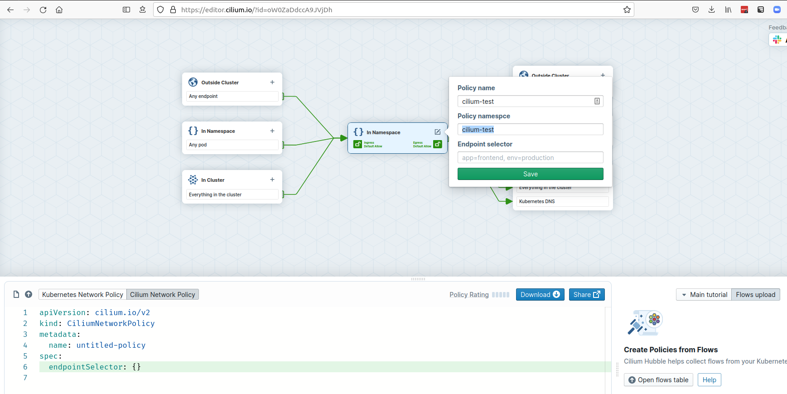
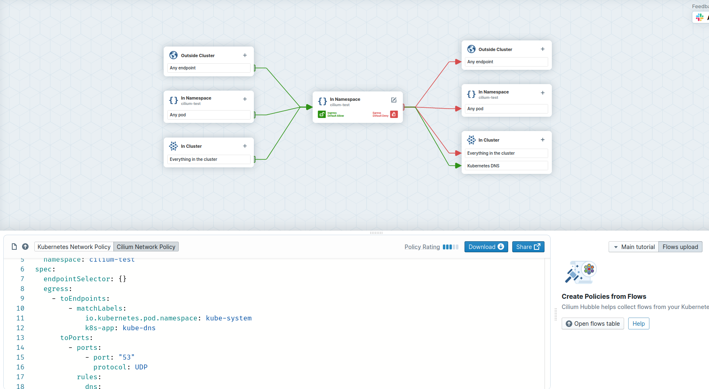
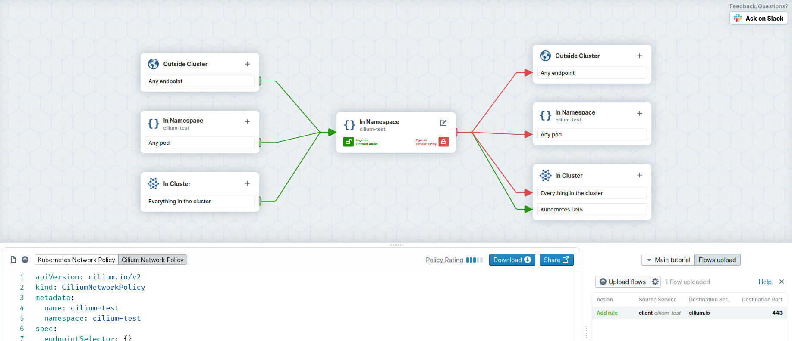
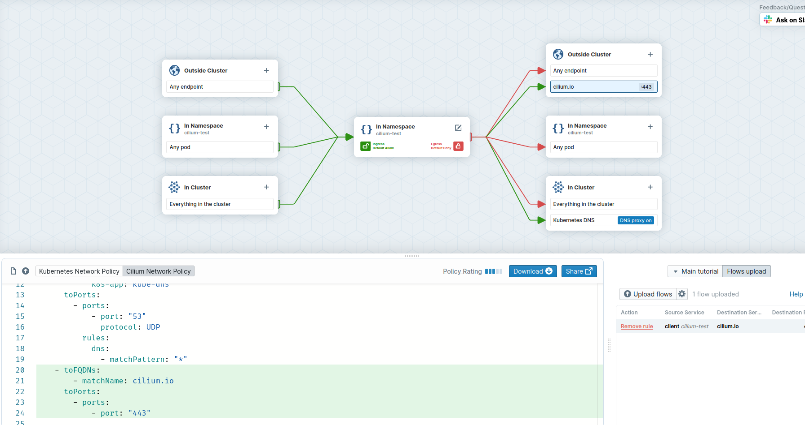

# Lab

## Create a cluster with kind

```
kind create cluster --name cilium-demo
```

## Install and setup Cilium with Hubble

```
cilium install  
cilium hubble enable --ui
cilium hubble port-forward &
cilium hubble ui &
cilium connectivity test
```
=> this creates namespace cilium-test which we will use later on!

## Requests should work to world on 443/tcp

```
BACKEND=$(kubectl get pods -n cilium-test -o jsonpath='{.items[0].metadata.name}')
kubectl -n cilium-test exec -ti ${BACKEND} -- curl -Ik --connect-timeout 5 https://cilium.io | head -1
HTTP/2 200
```

## Apply a first policy

```
apiVersion: cilium.io/v2
kind: CiliumNetworkPolicy
metadata:
  name: cilium-test
  namespace: cilium-test
spec:
  endpointSelector: {}
  egress:
    - toEndpoints:
        - matchLabels:
            io.kubernetes.pod.namespace: kube-system
            k8s-app: kube-dns
      toPorts:
        - ports:
            - port: "53"
              protocol: UDP
          rules:
            dns:
              - matchPattern: "*"
```

or go to https://editor.cilium.io and do it manually



* "Create new policy" (empty page bottom left)
* "Edit" icon in the middle of the page => enter a namespace and a policy name



* "Egress default deny"
* "Allow Kubernetes DNS"
* "Download" policy


Apply locally
```
kubectl apply -f cilium-test.yaml 
```

Observe
```
kubectl -n cilium-test exec -ti ${BACKEND} -- curl -Ik --connect-timeout 5 https://cilium.io | head -1
curl: (28) Connection timeout after 5001 ms
command terminated with exit code 28
hubble observe --output jsonpb --last 1000  > backend-cilium-io.json
```
=> won't work, as we have zero-trust by default


## Apply new rule that allows access to cilium.io


```
apiVersion: cilium.io/v2
kind: CiliumNetworkPolicy
metadata:
  name: cilium-test
  namespace: cilium-test
spec:
  endpointSelector: {}
  egress:
    - toEndpoints:
        - matchLabels:
            io.kubernetes.pod.namespace: kube-system
            k8s-app: kube-dns
      toPorts:
        - ports:
            - port: "53"
              protocol: UDP
          rules:
            dns:
              - matchPattern: "*"
    - toFQDNs:
        - matchName: cilium.io
      toPorts:
        - ports:
            - port: "443"
```

or go to https://editor.cilium.io and do it manually



* Upload Flows
* Add Rule
* Download 



Apply locally
```
kubectl apply -f cilium-test-2.yaml
```

## Verify

```
kubectl -n cilium-test exec -ti ${BACKEND} -- curl -Ik --connect-timeout 5 https://kubernetes.io | head -1
curl: (28) Connection timeout after 5001 ms
command terminated with exit code 28
```
=> doesn't work

```
kubectl -n cilium-test exec -ti ${BACKEND} -- curl -Ik --connect-timeout 5 https://cilium.io | head -1
HTTP/2 200
```
=> works!
